# Distributed Control and Communication Framework for Connectivity Preservation in Flow-Driven Robot Fleets

**Prajjwal Dutta**<sup>1</sup>, **Geoff Hollinger**<sup>2</sup>, **Xi Yu**<sup>1</sup>

<sup>1</sup> School of Manufacturing Systems and Networks, Arizona State University &nbsp;·&nbsp;
<sup>2</sup> Department of Mechanical, Industrial, and Manufacturing Engineering, Oregon State University

*IEEE/RSJ International Conference on Intelligent Robots and Systems (IROS) 2026*

<p align="center">
  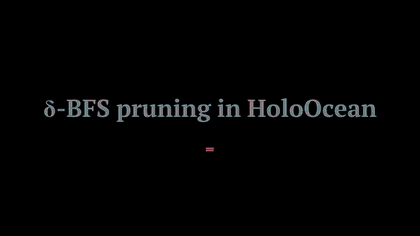
</p>

<p align="center"><em>δ-BFS topology pruning running online on a BlueROV2 fleet in HoloOcean: 10 robots, then 20. Red lines are the communication links being kept.</em></p>

---

## Table of Contents

1. [TL;DR](#tldr)
2. [Motivation](#motivation)
3. [Contributions](#contributions)
4. [System Architecture](#system-architecture)
5. [Modeling and Problem Formulation](#modeling-and-problem-formulation)
6. [Method I: Communication-Feasible δ-BFS Topology Pruning](#method-i-communication-feasible-δ-bfs-topology-pruning)
7. [Method II: CLF–CBF–QP Safety Filter on Maintained Edges](#method-ii-clfcbfqp-safety-filter-on-maintained-edges)
8. [Experimental Setup](#experimental-setup)
9. [Results](#results)
10. [3D HoloOcean Validation](#3d-holoocean-validation)
11. [Limitations and Future Work](#limitations-and-future-work)
12. [How the Work Evolved](#how-the-work-evolved)
13. [Repository Contents](#repository-contents)
14. [Citation](#citation)
15. [Acknowledgments](#acknowledgments)
16. [References](#references)

---

## TL;DR

Underwater robot fleets that drift with ocean currents spread out and lose communication links. Existing connectivity methods either need global information, such as the Fiedler value, or put constraints on *every* neighbor link. Both are too expensive for short-range, lossy, low-bandwidth acoustic channels.

We use **two layers**:

1. **δ-BFS pruning (graph layer).** Each robot broadcasts a **6-byte** message `(id, δ, seq)` holding its hop count to a root. Each robot then picks one parent that is one hop closer to the root. When a pruning epoch converges, the result is a **spanning tree** with exactly $N-1$ edges. The protocol uses only one-hop messages and still works with packet drops, delays, asynchronous broadcasts, and neighbors joining or leaving.
2. **CLF–CBF–QP (control layer).** Each robot solves a small QP. It changes a goal-seeking command as little as possible while avoiding collisions and keeping range **only on its tree edges**.

**Headline results** (compared with an adjacency-consensus pruning baseline, 100% success rate for both):

| Team size | Convergence time | Delivered payload rate | Final edges |
|:---:|:---:|:---:|:---:|
| $N=10$ | **~11.5× faster** (5.68 s vs 65.53 s) | **~54× lower** (465 vs 25,208 B/s) | **9** vs 18 |
| $N=20$ | **~36.6× faster** (8.42 s vs 208.02 s) | **~151× lower** (1,972 vs 297,805 B/s) | **19** vs 27 |

We validated the full pipeline end to end in the **3D HoloOcean** simulator with multiple **BlueROV2** vehicles under advection–diffusion currents and a degraded communication channel.

---

## Motivation

We target robot fleets in large, flow-dominated underwater environments, such as the deep ocean and under-ice cavities, where:

- **localization may be unavailable**,
- **communication is short-range, intermittent, and bandwidth-limited**, and
- **currents and eddies dominate how robots move**, while onboard energy for thrust is limited.

The concept of operations is **coverage first, then reconfiguration**. The robots are released together and use the flow to drift and spread out, which enlarges the area they can sense. Control is applied only when needed to keep them within bounds and connected. When a robot detects a target, the team reconfigures toward it **without losing end-to-end connectivity**.

Two problems remain open:

1. **Keeping the whole network connected** while flow-driven dispersion keeps changing who neighbors whom.
2. **Reaching goals with only local information** over unreliable, bandwidth-limited links.

**Why existing approaches don't fit:**

| Approach | Limitation in this setting |
|---|---|
| Spectral connectivity (Fiedler value) [13] | Needs global information or centralized computation, and is costly to maintain online |
| Distributed pairwise CBFs on *all* neighbors [14], [15] | Too much communication and control effort in dense graphs where neighbors keep changing |
| Sparse structure via MST + local CBFs [16] | Exact distributed MST (GHS, Awerbuch) needs many messages and heavy coordination [17], [18] |

For our problem, the topology does **not** need to be optimal. It **does** need to be buildable within realistic underwater communication budgets and channel impairments. This is why we build a spanning tree from constant-size broadcasts and explicitly measure the communication cost.

---

## Contributions

- **A distributed δ-BFS pruning protocol.** When an epoch converges, it builds a spanning-tree coordination topology using **constant-size broadcasts**. We explicitly account for the payload and measure tree success rates under packet drops, random delays, asynchronous updates, and neighbor churn.
- **A two-layer architecture.** It couples topology maintenance with CLF–CBF control, so robots can explore for coverage and reach goals. Collision avoidance and range maintenance are enforced **only on maintained edges**.
- **An evaluation in 3D HoloOcean** [21] with BlueROV2 [22] vehicles under an advection–diffusion motion model. We report pruning success, convergence time, and delivered bandwidth, along with closed-loop coverage and goal-reaching behavior.

---

## System Architecture

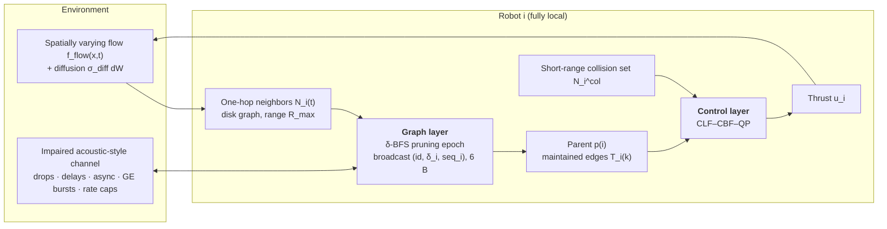

- **Graph layer (discrete epochs $t_k$).** Builds a sparse, connected coordination subgraph $\mathcal{G}_{\text{topo}} \subseteq \mathcal{G}_t$ from one-hop messages and prunes every other link.
- **Control layer (between epochs).** A nominal CLF drives the robots toward the task. CBFs enforce **range maintenance on maintained edges** and **collision avoidance on a separate short-range sensing set**. Advection and diffusion keep changing the disk graph, but the range CBFs stop maintained links from breaking between updates.

---

## Modeling and Problem Formulation

### Advection–diffusion motion model

A fleet of $N$ robots moves in $\mathbb{R}^n$ ($n=2$ for visualization and parameter sweeps, 3D for HoloOcean). The center of mass $\bar{x}(t) = \frac{1}{N}\sum_i x_i(t)$ drifts with the background flow, $\dot{\bar{x}} \approx f_{\text{flow}}(\bar{x}, t)$. Each robot spreads stochastically around this drifting center:

$$
dx_i(t) = \big(f_{\text{flow}}(x_i(t),t) + v_i(t)\big)\,dt + \sigma_{\text{diff}}\, dW_i(t), \qquad \dot{v}_i(t) = u_i(t) - \gamma v_i(t)
$$

Here $v_i$ is velocity, $u_i$ is the thrust input, $\gamma>0$ is damping, and $W_i$ is a Wiener process with intensity $\sigma_{\text{diff}}$.

**Discrete-time simulation (Euler–Maruyama):**

$$
x_i^{k+1} = x_i^k + \big(f_{\text{flow}}(x_i^k, t_k) + v_i^k\big)\Delta t + \sigma_{\text{diff}}\sqrt{\Delta t}\,\xi_i^k,\quad \xi_i^k \sim \mathcal{N}(0, I), \qquad v_i^{k+1} = v_i^k + (u_i^k - \gamma v_i^k)\Delta t
$$

The flow is assumed spatially smooth and Lipschitz: $\lVert f_{\text{flow}}(x,t) - f_{\text{flow}}(y,t)\rVert \le L_f \lVert x-y \rVert$. This allows **non-uniform** flows, in which relative drift does not cancel.

### Control-affine design model

The CLF–CBF synthesis uses a reduced model. The simulations still evolve robots under the full advection–diffusion model above.

$$
\dot{x}_i = f_{\text{flow}}(x_i,t) + u_i + d_i, \qquad \lVert d_i \rVert \le \bar{d}
$$

**Relative dynamics.** Let $z_{ij} = x_i - x_j$ and $\Delta f_{\text{flow}}(x_i,x_j,t) = f_{\text{flow}}(x_i,t) - f_{\text{flow}}(x_j,t)$. Robot $i$ cannot see its neighbor's instantaneous control. It uses the last received estimate, $u_j = \hat{u}_j + e_{ij}$ with $\lVert e_{ij} \rVert \le \bar{e}$, which gives the form used in the robust CBF constraints:

$$
\dot{z}_{ij} = \Delta f_{\text{flow}}(x_i,x_j,t) + (u_i - \hat{u}_j) + (d_i - d_j) - e_{ij}
$$

The flow term cancels **only** when the flow is spatially uniform. Otherwise its variation is bounded through $L_f$.

### Assumptions

| # | Assumption |
|---|---|
| **A1: Communication** | The network is an undirected **disk graph**, $(i,j)\in\mathcal{E}_t \iff \lVert x_i - x_j\rVert \le R_{\max}$. Robots talk only to one-hop neighbors $\mathcal{N}_i(t)$, with no central coordinator. Every robot has a unique ID, and $\mathcal{G}_0$ is connected. Inputs and disturbances are bounded: $\lVert u_i\rVert \le u_{\max}$, $\lVert d_i \rVert \le \bar d$. |
| **A2: Margins and authority** | There exist $\varepsilon_s, \varepsilon_c > 0$ with $0 < d_{\min} + \varepsilon_s < R_{\max} - \varepsilon_c$, and enough control authority: $u_{\max} > \bar{d} + L_f R_{\max}$. |
| **A3: Bounded staleness** | On each maintained link, robot $i$ receives $\hat u_j(t) = u_j(t-\tau_{ij}(t))$ with $\tau_{ij} \le \bar\tau$. If $\lVert \dot u_j \rVert \le \bar\nu$, then $\lVert e_{ij}\rVert \le \bar e = \bar\nu\bar\tau$. |

The channel is **local and unreliable**: packets may be dropped, delayed, or received asynchronously.

### Problem statement

We define the safe set and the link-maintenance set:

$$
\mathcal{C}_{\text{safe}} = \lbrace x : \lVert x_i - x_j\rVert \ge d_{\min},\ \forall i\neq j \rbrace, \qquad
\mathcal{C}_{\text{conn}}(\mathcal{E}) = \lbrace x : \lVert x_i - x_j\rVert \le R_{\max},\ \forall (i,j)\in\mathcal{E} \rbrace
$$

Targets are unknown in advance and are detected only when a robot comes within sensing range. Each robot sees only its local information $\mathcal{I}_i(t)$: its own state, relative positions of neighbors, one-hop messages, and local graph quantities. There is **no centralized computation, no global map, and no spectral quantity**.

**Goal:** design a distributed feedback law $u_i = \kappa_i(\mathcal{I}_i)$ and a concurrent pruning rule that produces $\mathcal{E}_{\text{topo}}(t)\subseteq\mathcal{E}_t$, such that for all $t\ge0$:

1. $x(t)\in\mathcal{C}_{\text{safe}}$, $x(t)\in\mathcal{C}_{\text{conn}}(\mathcal{E}_{\text{topo}}(t))$, and $\mathcal{G}_{\text{topo}}(t)$ stays connected;
2. the controller exploits advection and uses minimal actuation;
3. the team spreads out for coverage and periodically rebuilds a sparse topology using one-hop messages. Performance is measured by tree success rate, convergence time, and delivered bandwidth under impaired communication.

---

## Method I: Communication-Feasible δ-BFS Topology Pruning

### 1) Scalar hop-to-root propagation

At the start of each epoch, a root $r$ (the robot with the smallest ID, fixed for the whole run) sets $\delta_r = 0$. Every other robot sets $\delta_i = \infty$. Each robot periodically broadcasts the **constant-size** tuple $(i, \delta_i, s_i)$, where $s_i$ is a sequence counter. When robot $i$ receives $(j, \delta_j, s_j)$, it updates

$$
\delta_i \leftarrow \min\lbrace\delta_i,\ \delta_j + 1\rbrace
$$

This is an online, unweighted Bellman–Ford-style BFS over the time-varying neighbor graph.

### 2) Local parent selection and pruning

After the epoch ($T_{\text{prune}}$, or earlier if $\delta$ has not changed for $T_{\text{stable}}$), each non-root robot picks a parent one hop closer to the root, breaking ties by smallest ID:

$$
p(i) \in \arg\min_{j\in\mathcal{N}_i(t)} \delta_j \ \ \text{s.t.}\ \ \delta_{p(i)} = \delta_i - 1, \qquad
\mathcal{E}_{\text{topo}} = \lbrace (i, p(i)) : i\neq r,\ p(i)\ \text{defined} \rbrace
$$

Each robot keeps **at most one outgoing topology edge**. Together these edges form a spanning tree when the epoch converges.

### Algorithm 1: Communication-feasible δ-BFS pruning

```text
Input : neighbor set N_i, root id r, T_prune, T_stable
Output: local parent p(i) and maintained edge (i, p(i)) if defined
Msg   : <i, δ_i, s_i>                         # constant size, 6 bytes payload

δ_i ← 0 if i = r else ∞
p(i) ← ∅ ;  s_i ← 0 ;  t_upd ← 0 ;  s_last[j] ← -1  for all j ∈ N_i

while t < T_prune and (t - t_upd) < T_stable:
    broadcast <i, δ_i, s_i> to all j ∈ N_i ;  s_i ← s_i + 1
    for each received <j, δ_j, s_j>:
        if s_j > s_last[j]:                   # drop duplicates / out-of-order
            s_last[j] ← s_j
            δ_new ← min(δ_i, δ_j + 1)
            if δ_new < δ_i:
                δ_i ← δ_new ;  t_upd ← t

if i ≠ r and δ_i < ∞:
    P_i ← { j ∈ N_i : δ_j = δ_i - 1 }
    if P_i ≠ ∅:  p(i) ← min_id(P_i)           # tie-break: smallest ID

return (i, p(i)) if p(i) ≠ ∅ ;   E_topo = { (i, p(i)) : i ≠ r, p(i) ≠ ∅ }
```

**Robustness features built in:**
- asynchronous broadcasts with **jittered periods**;
- **duplicate and out-of-order suppression** via sequence counters;
- **early epoch termination** once the hop estimates stop changing;
- **fallback:** if an epoch fails to converge, robots keep the last valid topology for one epoch. If no valid topology exists yet, they maintain *all* current neighbor links for one epoch and then retry pruning.

### Worked example (N = 6, root r = 1)

<p align="center">
  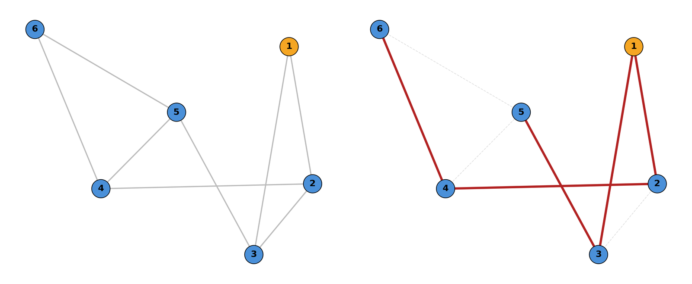
</p>

*Left: initial communication graph. Right: maintained topology after local parent selection (red edges). Pruned links are shown faded.*

- Converged hop estimates: $\delta_1=0,\ \delta_2=\delta_3=1,\ \delta_4=\delta_5=2,\ \delta_6=3$
- Parents: $p(2)=1,\ p(3)=1,\ p(4)=2,\ p(5)=3,\ p(6)=4$
- Maintained edges: $\mathcal{E}_{\text{topo}} = \lbrace(1,2),(1,3),(2,4),(3,5),(4,6)\rbrace$, which is 5 edges, $N-1$.
- Equivalently, keep edge $\lbrace i,j \rbrace$ if and only if $p(i)=j$ or $p(j)=i$.

### Why not a distributed MST?

Exact distributed MST algorithms need many messages and heavy coordination, which does not fit underwater bandwidth limits and impairments. Tree *optimality* is not the constraint that matters here; **being buildable within the communication budget** is. δ-BFS gives up edge-weight optimality in exchange for constant-size payloads and fast convergence.

---

## Method II: CLF–CBF–QP Safety Filter on Maintained Edges

After an epoch produces $\mathcal{E}_{\text{topo}}$, each robot applies a standard CLF–CBF–QP safety filter. It changes a nominal goal-seeking command as little as possible to satisfy the safety constraints. The contribution of this work is the communication-feasible topology layer, not the CLF–CBF construction itself.

| Component | Definition | Constraint |
|---|---|---|
| **Goal CLF** | $V_i(x_i) = \lVert x_i - g\rVert^2$, with $g\in\mathbb{R}^3$ | $\dot V_i \le -c_V V_i + \epsilon_i$, $\ \epsilon_i \ge 0$ (relaxed) |
| **Range CBF** (maintained edges only) | $h_{ij}(x) = R_{\max}^2 - \lVert x_i - x_j\rVert^2$ | $\dot h_{ij} + \alpha_h h_{ij} \ge 0,\ \ \forall (i,j)\in\mathcal{E}_{\text{topo}}$ |
| **Collision CBF** (short-range set, independent of topology) | $h^{\text{col}}_{ij}(x) = \lVert x_i - x_j\rVert^2 - d_{\min}^2$ | $\dot h^{\text{col}}_{ij} + \alpha_c h^{\text{col}}_{ij} \ge 0,\ \ \forall j\in\mathcal{N}_i^{\text{col}}$ |

**Per-robot QP** (solved at every control update):

$$
\begin{aligned}
u_i^\star \in \arg\min_{u_i,\ \epsilon_i}\quad & \lVert u_i - u_i^{\text{nom}}\rVert^2 + \rho\,\epsilon_i^2 \\
\text{s.t.}\quad & \dot V_i(x_i) \le -c_V V_i(x_i) + \epsilon_i, \\
& \dot h_{ij}(x) + \alpha_h h_{ij}(x) \ge 0 \quad \forall j:(i,j)\in\mathcal{E}_{\text{topo}}, \\
& \dot h^{\text{col}}_{ij}(x) + \alpha_c h^{\text{col}}_{ij}(x) \ge 0 \quad \forall j\in\mathcal{N}_i^{\text{col}}, \\
& \lVert u_i\rVert \le u_{\max},\quad \epsilon_i \ge 0
\end{aligned}
$$

Constraining only the **N−1 tree edges** instead of every instantaneous neighbor keeps the QP small and cuts the per-link control-state traffic. The relative dynamics include the flow difference and the neighbor-control staleness (A3).

---

## Experimental Setup

We run two kinds of experiments:

1. **Synthetic communication stress tests.** These isolate the pruning protocol on random connected graphs under packet drops, bounded random delays, and asynchronous broadcasts. They measure TX/RX counts, delivered bandwidth, and convergence time.
2. **End-to-end 3D HoloOcean simulations** with BlueROV2 vehicles under advection–diffusion dynamics. Robots are released together, drift and spread with the flow, and then reconfigure toward a detected goal. Asynchronous topology updates track neighbor churn while the controller enforces range maintenance.

### Baselines

| Strategy | What it does | Trade-off |
|---|---|---|
| **Fully Connected** | Keeps every instantaneous disk-graph edge | Highest connectivity, highest communication and control cost |
| **Centralized MST (oracle)** | Recomputes an MST from a *global* snapshot every epoch | Ideal lower bound on edge count, but not implementable with one-hop messages |
| **Adjacency Consensus** | Exchanges one-hop neighbor *lists* and prunes an edge only when a two-hop witness shows it is redundant | Conservative pruning with variable-size payloads, so more messaging |
| **Distributed Pruning: δ-BFS (ours)** | Constant-size `(id, δ, seq)` broadcasts plus local parent selection | Spanning tree on convergence with a minimal payload |

### Communication impairment models

| Impairment | Model |
|---|---|
| IID loss / delay / async | $p_{\text{drop}}$, bounded random delay $\tau_{\max}$, broadcast jitter $j$ |
| **Bursty loss** | Two-state **Gilbert–Elliott** channel (Good/Bad states) |
| **Bandwidth bottleneck** | Per-robot **TX rate cap** with a **FIFO transmit queue** |
| **Distance-dependent loss** | Drop probability grows with inter-robot distance (weak vs strong dependence) |

### Metrics

- **Tree success rate (%)** over Monte Carlo trials. An epoch succeeds if $\mathcal{G}_{\text{topo}}$ is a connected spanning tree, that is, connected with $|\mathcal{E}_{\text{topo}}| = N-1$.
- **Time to first tree** $t_{\text{tree}}$ and **time to stable tree** $t_{\text{stable}}$ (the tree stays valid for $T_{\text{stable}}$).
- **TX/RX counts per epoch** and **delivered pruning payload throughput (B/s)**.
- **Transmit-queue delay p95** (enqueue-to-send) and overflow rate.
- **Edge reduction** $= \dfrac{|\mathcal{E}(t_k)| - |\mathcal{E}_{\text{topo}}(k)|}{|\mathcal{E}(t_k)|}\times 100\%$.
- HoloOcean only: **goal-reaching time** or final distance to goal, **connectivity preservation** (fraction of time connected), and **safety** (minimum inter-robot distance).

---

## Results

### Communication cost vs adjacency consensus (Table I)

| $N$ | Method | Success (%) | Conv. time (s) | Payload (B/s) | Final edges |
|:---:|---|:---:|---:|---:|:---:|
| 10 | **δ-BFS** | 100 | **5.68 ± 0.20** | **465 ± 25** | **9** |
| 10 | Adj-Consensus | 100 | 65.53 ± 36.52 | 25,208 ± 2,289 | 18 |
| 20 | **δ-BFS** | 100 | **8.42 ± 1.13** | **1,972 ± 96** | **19** |
| 20 | Adj-Consensus | 100 | 208.02 ± 22.33 | 297,805 ± 49,986 | 27 |

δ-BFS **matches the success rate (100%)** of adjacency consensus while:
- converging **~11.5×** ($N=10$) and **~36.6×** ($N=20$) **faster**,
- cutting delivered payload rate by **~54×** ($N=10$) and **~151×** ($N=20$), and
- producing a **sparser** graph: exactly $N-1$ edges (a tree) versus 18 and 27.

The advantage **grows with team size**, because adjacency-consensus payloads grow with neighborhood size while δ-BFS messages stay constant.

### Lossy-channel accounting

Each broadcast carries **6 bytes of payload** (excluding transport overhead). With $p_{\text{drop}}=0.1$, $\tau_{\max}=0.5$, $j=0.2$:

| $N$ | Convergence | Delivered RX payload |
|:---:|:---:|:---:|
| 10 | 9.27 s | 95.5 B/s |
| 20 | 9.85 s | 239.4 B/s |

Convergence time barely changes when the team size doubles.

### Bursty loss: Gilbert–Elliott channel (Fig. 2)

<p align="center">
  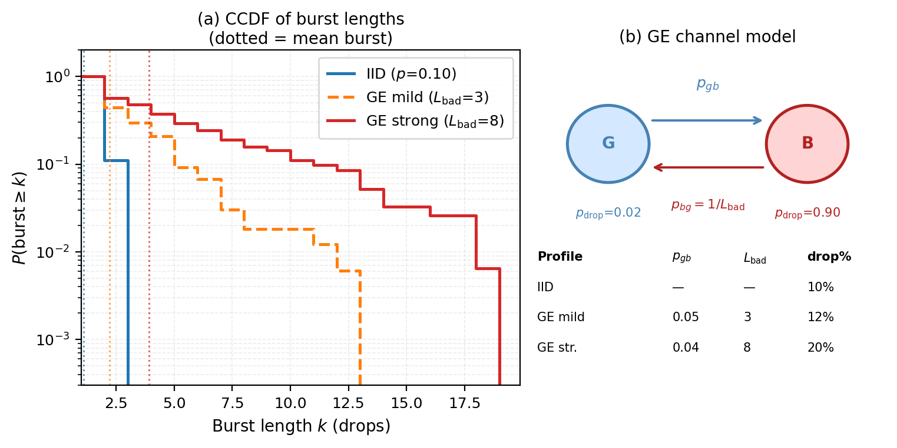
</p>

| Profile | $p_{gb}$ | $L_{\text{bad}}$ | Overall drop % |
|---|:---:|:---:|:---:|
| IID | — | — | 10% |
| GE mild | 0.05 | 3 | 12% |
| GE strong | 0.04 | 8 | 20% |

The Good state has $p_{\text{drop}}=0.02$, the Bad state has $p_{\text{drop}}=0.90$, and $p_{bg} = 1/L_{\text{bad}}$. Under GE, the CCDF of burst lengths has a much heavier tail than under IID loss. **Longer consecutive outages** are what slow hop-count propagation during a pruning epoch.

### Bandwidth bottleneck: FIFO rate limiting (Fig. 3, Table II)

<p align="center">
  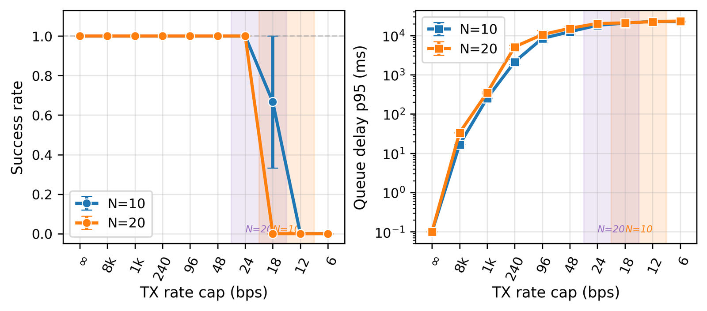
</p>

As the per-robot TX rate cap drops, the p95 transmit-queue delay rises sharply. Pruning success **collapses below a breakpoint that depends on team size: 12–18 bps for $N=10$ and 18–24 bps for $N=20$**.

**Table II: FIFO rate limiting summary** ($T_{\text{prune}} = 30$ s, 10 seeds per row; *rx* = delivered pruning payload throughput)

| $N$ | Cap (bps) | Regime | Success | $t_{\text{tree}}$ (s) | Delay p95 (ms) | rx (B/s) |
|:---:|:---:|---|:---:|:---:|:---:|:---:|
| 10 | ∞ | No limit | 1.00 | 2.9 ± 0.2 | 0 | 185 |
| 10 | 250 | High cap | 1.00 | 4.3 ± 0.1 | 2,135 ± 359 | 169 |
| 10 | 48 | 2× above breakpoint | 1.00 | 11.5 ± 0.7 | 12,483 ± 1,336 | 38 |
| 10 | 30 | Above breakpoint | 1.00 | 18.0 ± 2.0 | 15,094 ± 2,288 | 18 |
| 10 | 18 | Near breakpoint (partial) | 0.67 | 27.8 ± 1.4 | 20,700 ± 317 | 10 |
| 10 | 12 | Below breakpoint (failure) | 0.00 | – | 22,939 ± 664 | 3 |
| 20 | ∞ | No limit | 1.00 | 3.0 ± 0.1 | 0 | 546 |
| 20 | 250 | High cap | 1.00 | 5.0 ± 0.1 | 4,717 ± 274 | 405 |
| 20 | 48 | 2× above breakpoint | 1.00 | 15.0 ± 0.5 | 15,261 ± 1,891 | 67 |
| 20 | 30 | Above breakpoint | 1.00 | 20.6 ± 0.8 | 19,439 ± 679 | 38 |
| 20 | 24 | Near breakpoint (first success) | 1.00 | 27.2 ± 0.9 | 20,317 ± 584 | 27 |
| 20 | 18 | Below breakpoint (failure) | 0.00 | – | 20,933 ± 591 | 13 |

**Takeaway:** δ-BFS still reliably builds a tree at caps as low as **30 bps** for both team sizes (18 bps for $N=10$ and 24 bps for $N=20$ in the best case). The feasibility breakpoint rises only modestly when the team size doubles.

### Distance-dependent impairments (Fig. 4)

<p align="center">
  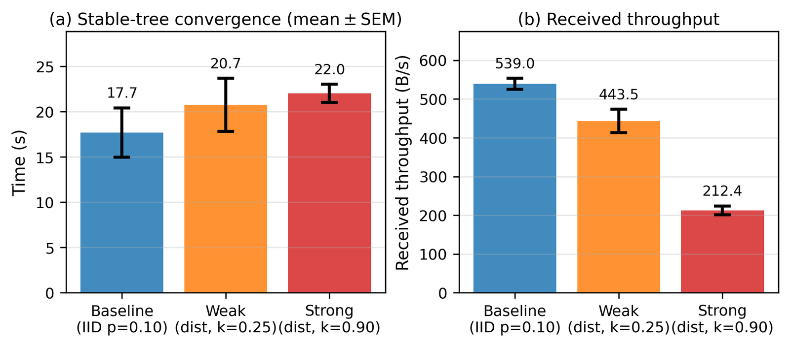
</p>

$N=20$, 5 seeds.

| Channel | Stable-tree convergence (s, mean ± SEM) | Received throughput (B/s) |
|---|:---:|:---:|
| Baseline (IID, $p=0.10$) | 17.7 | 539.0 |
| Weak distance dependence ($k=0.25$) | 20.7 | 443.5 |
| Strong distance dependence ($k=0.90$) | 22.0 | 212.4 |

Stronger distance dependence **increases stabilization time and lowers throughput**, but **success stays high** in this regime.

### Sparsification over time (Fig. 5)

<p align="center">
  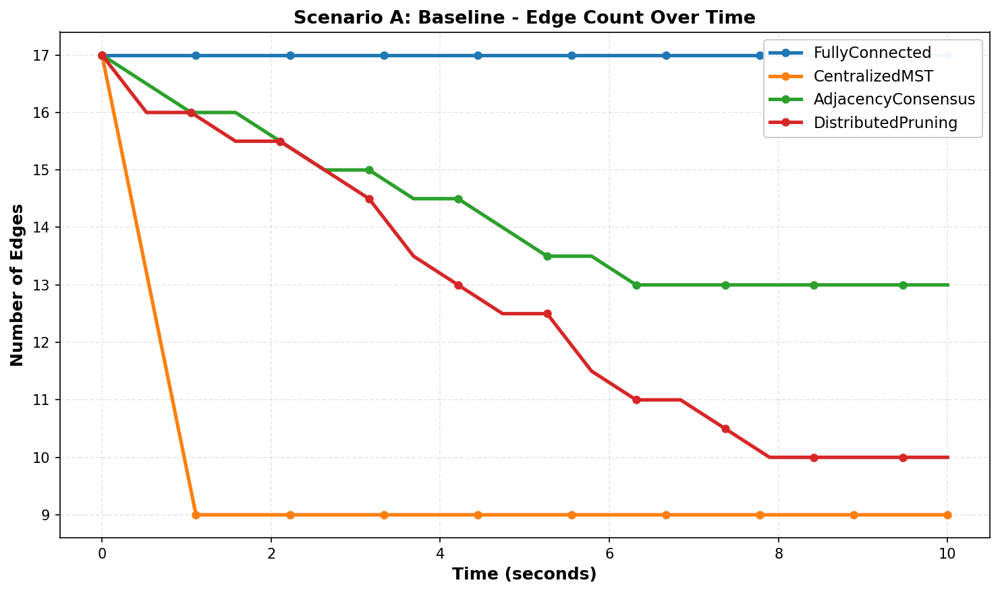
</p>

Starting from 17 edges in a lightweight simulator:
- **Fully Connected** keeps all 17 links.
- **Centralized MST (oracle)** drops to $N-1 = 9$ edges immediately, but needs global information.
- **Distributed Pruning (δ-BFS)** steadily reduces the edge set to a sparse, near-tree structure (**10 edges**).
- **Adjacency Consensus** stays denser (**13 edges**).

---

## 3D HoloOcean Validation

The full pipeline runs in the **HoloOcean** simulator [21] (Unreal Engine) with multiple **BlueROV2** vehicles [22]:

- robot motion follows the **advection–diffusion model**, which causes neighbor churn in the disk graph;
- robots run **δ-BFS pruning epochs** (Alg. 1) online under packet drops, bounded random delays, and asynchronous broadcasts;
- the **CLF–CBF–QP** layer maintains range on tree edges and avoids collisions while the fleet moves toward a goal (the black wireframe cube).

<p align="center">
  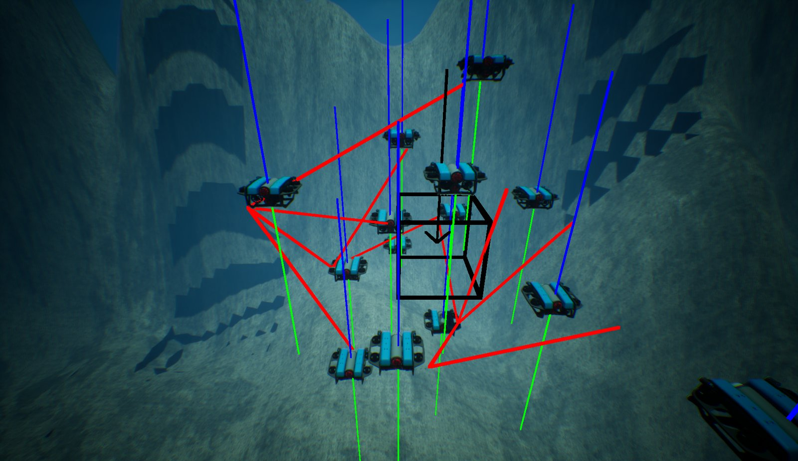
</p>

*Fig. 6: HoloOcean scene with a BlueROV2 fleet during flow-driven dispersion. Red segments are the maintained δ-BFS edges, and the black cube is the goal region.*

<p align="center">
  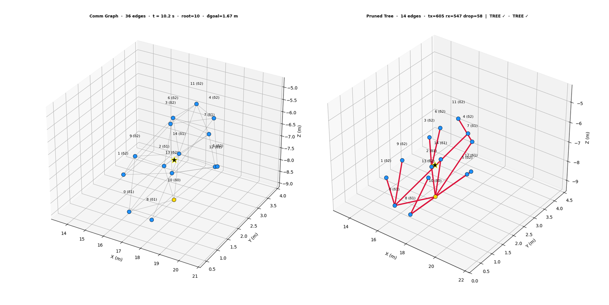
</p>

*Fig. 7: A HoloOcean pruning epoch ($N=15$, $R_{\max}=2.0$ m, $p_{\text{drop}}=0.1$).*

- **Left:** the instantaneous disk graph has **36 edges** at $t=10.2$ s, with distance to goal 1.67 m.
- **Right:** the pruned tree has **14 edges** ($N-1$), a **~61% edge reduction**. The epoch took **605 TX, 547 RX, and 58 drops**, and the tree check passed.

### Demo videos

| 10 robots: critical edges maintained | Scaling up to 20 robots |
|:---:|:---:|
| 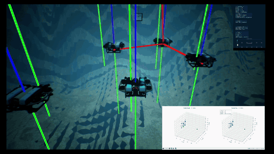 | 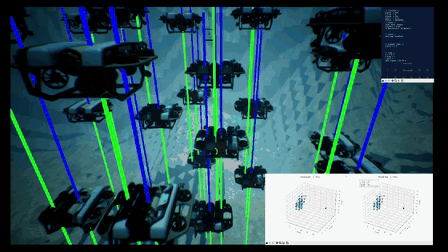 |
| Edges are pruned with δ-BFS while the fleet drifts and converges on the goal cube. The inset shows the live comm graph and the pruned tree. | The same protocol and controller with 20 vehicles. The tree is rebuilt online as neighbors change. |

*GIFs are 2× speed-ups of the IROS 2026 video.*

---

## Limitations and Future Work

**Current limitations**
- Reported payload bytes **exclude protocol and transport overhead**, so they are a **lower bound** on total channel use.
- Impairments are modeled at the **message level** (drops, bounded delays, async broadcasts, GE bursts, rate caps). There is no full acoustic modem model with packet-level effects or a realistic MAC stack.
- The root is **fixed** (smallest ID). **Root failure and distributed re-election** are not studied.
- The tree is **unweighted**: it is a BFS tree, not an MST. Edge lengths and link quality are not optimized.

**Future work**
1. Add higher-fidelity acoustic modem and packet-level network models.
2. Scale to larger teams and longer missions with repeated reconfiguration events.
3. Validate on field robots in real currents.

---

## How the Work Evolved

This paper went through several revisions. The main shifts in framing were:

| Stage | Main framing |
|---|---|
| **ACC 2026 submission** | Earlier version of the distributed connectivity-and-control idea. The reviewer feedback shaped the IROS resubmission plan. |
| **IROS 1st draft** | Robots prune *non-critical* edges from a fully connected start. The claim was that the spanning structure converges toward a **minimum spanning tree**. |
| **IROS 2nd draft** | Pruning rebuilt around **neighbor-to-neighbor message exchange** and a spanning-tree coordination structure. Emphasis on edge reduction and low control effort under bounded disturbances. |
| **IROS 3rd draft** | Recast as a **two-layer systems architecture**. **Communication budgets** made explicit (bytes/message, messages/update, delivered bandwidth). Impairments (drops, delays, async, churn) and **3D HoloOcean + BlueROV2** validation added. |
| **IROS 4th draft** | Guarantees made precise: a tree forms **when the pruning epoch converges**, measured by tree success rate and convergence time. |
| **IROS 2026 Final** *(this README)* | Mission restated as **coverage-driven exploration + target discovery**. **Gilbert–Elliott bursty loss, FIFO rate-cap, and distance-dependent** stress tests added. δ-BFS vs adjacency-consensus comparison (Table I) and FIFO breakpoint analysis (Table II) added. |

---

## Repository Contents

This repository holds my complete PhD research workspace: code, experiments, manuscripts and supporting material. The IROS 2026 paper described above is the most recent and complete result.

### Where to start

| If you want… | Go to |
|---|---|
| The **δ-BFS protocol, CLF–CBF controller, baselines and 2D stress tests** | [`Coding/Python/Comunication algorithm most recent work/`](Coding/Python/Comunication%20algorithm%20most%20recent%20work/) |
| The **3D HoloOcean + BlueROV2 experiments** (pruning epochs, GE channel, rate-cap sweeps, paper figures) | [`Coding/Simulator/holoocean/holoocean_pruning_project/`](Coding/Simulator/holoocean/holoocean_pruning_project/) |
| The **final paper and every draft** | [`Conference/IROS 2026/`](Conference/IROS%202026/) |

### Map

```text
.
├── README.md                                   # this document
├── media/                                      # README GIFs + figures extracted from the final paper
│
├── Coding/
│   ├── Python/
│   │   ├── Comunication algorithm most recent work/   # ★ main codebase for ACC 2026 → IROS 2026
│   │   │   ├── distributed_pruning/, concurrent_pruning/, consensus/, consensus_baseline/
│   │   │   ├── Critical_edge_detection_baseline/, GHS/, Minimum_Spanning_Tree_new_mwthond/, baseline methods/
│   │   │   ├── controllers/ (CLF–CBF), core/, graph/, simulation/, visualization/, utils/, config/
│   │   │   ├── experiments*/  (scenario and time-series results; files >10 MB omitted)
│   │   │   ├── tests/, test_*.py, validate_cbf_final.py
│   │   │   └── ACC_2026/ (LaTeX source), docs/, figures/, *.md implementation notes
│   │   ├── Decentralized Connectivity and Control/    # earlier iterations (Mach 7, Old, ongoing) + demo media
│   │   ├── Working codes/                             # MLCCST, decentralized CLF–CBF, flow-field prototypes
│   │   ├── Baseline Implementation of the papers/     # re-implementations: deadlock resolution; reconfigurable coordination
│   │   ├── Glider_sim/                                # 6-DOF underwater glider simulator
│   │   └── *.gif                                      # early simulation animations
│   ├── Simulator/
│   │   ├── holoocean/                                 # ONLY my additions to the HoloOcean clone (see note below)
│   │   │   ├── holoocean_pruning_project/             # ★ IROS HoloOcean runs: pruning/, holoocean_runs/, sweeps/,
│   │   │   │                                          #   stress_results_holoocean/, figures/, notes/
│   │   │   ├── holoocean sequential pruning/          # sequential-pruning algorithm + verification scripts
│   │   │   └── client/test.py, client/tests/*         # keyboard / autonomous BlueROV2 control tests
│   │   └── Ocean Package details.txt
│   ├── MATLAB/                                        # Mach 1 distributed-obstacle CBF prototype, task scripts
│   ├── Blimp/                                         # ROS 2 blimp workspace (WVU Blimps team, GPLv3)
│   └── Documentation Reports/Mothership_Report/       # semester report (LaTeX + PDF)
│
├── Conference/
│   ├── IROS 2026/                                     # final paper, drafts 1–4, plans, ICRA update slides, figures, small videos
│   ├── IROS_2026_1st_draft/                           # LaTeX source of the first IROS draft
│   ├── ACC 2026/                                      # ACC paper, revision plans, media
│   ├── SWRS Poster/                                   # SWRS 2025 poster and report
│   └── ICRA Workshop.pdf, Conference list.xlsx
│
├── HW 26 Dec, 2025/                                   # literature review + Research-Assignment (MATLAB/ROS 2 navigation stack)
├── Reading/                                           # READING_LIST.md (titles only) + my notes
└── PPT/Images/                                        # whiteboard notes
```

### What is intentionally not included

| Omitted | Why |
|---|---|
| Files larger than **10 MB** (full-resolution videos, the ~97 MB `comprehensive_results_*.json` experiment dumps, large GIFs and decks) | Upload size. The GIFs in `media/` cover the IROS video. |
| Upstream **HoloOcean** simulator source and Unreal assets | Third-party code: get it from [byu-holoocean/HoloOcean](https://github.com/byu-holoocean/HoloOcean) (v2.2.2). Only my own additions are tracked here. |
| `mothership-comms-controls-simulator`, `clean_modular_repo` | These belong to a private lab repository. |
| Published papers (`Reading/` PDFs and paper PDFs inside code folders) | Copyrighted. See [`Reading/READING_LIST.md`](Reading/READING_LIST.md). |
| Purchase lists, receipts, reimbursement forms, NIWC material | Administrative or not part of this research. |
| `latex/` (MiKTeX install), `.venv`, `__pycache__`, LaTeX build artifacts, installers | Tooling and caches. |

---

## Citation

If you find this work useful, please cite:

```bibtex
@inproceedings{dutta2026distributed,
  title     = {Distributed Control and Communication Framework for Connectivity Preservation in Flow Driven Robot Fleets},
  author    = {Dutta, Prajjwal and Hollinger, Geoff and Yu, Xi},
  booktitle = {IEEE/RSJ International Conference on Intelligent Robots and Systems (IROS)},
  year      = {2026}
}
```

---

## Acknowledgments

This work was supported by the **NSF Awards 2322055 and 2529791**.

---

## References

1. A. Muto *et al.*, "Meshed observations of the remote subsurface with heterogeneous intelligent platforms (Mothership)," *AGU Fall Meeting Abstracts*, 2024.
2. B. Schiel *et al.*, "Using orthogonal chirps underwater for in-band, full-duplex communication with minimal self-interference cancellation," *WUWNet*, 2024.
3. B. Schiel and P. Lundrigan, "Role-based network addressing for fleets of autonomous underwater vehicles," *WUWNet*, 2024.
4. N. L. Butler and G. A. Hollinger, "Hybrid decentralization for multi-robot orienteering with mothership-passenger systems," *ICRA*, 2025.
5. C. Wei, H. G. Tanner, X. Yu, and M. A. Hsieh, "Low-range interaction periodic rendezvous along Lagrangian coherent structures," *ACC*, 2019.
6. G. Knizhnik, P. Li, X. Yu, and M. A. Hsieh, "Flow-based control of marine robots in gyre-like environments," *ICRA*, 2022.
7. G. I. Taylor, "Diffusion by continuous movements," *Proc. London Math. Soc.*, 1922.
8. A. Okubo, "Oceanic diffusion diagrams," *Deep Sea Research*, 1971.
9. A. J. Majda and P. R. Kramer, "Simplified models for turbulent diffusion," *Physics Reports*, 1999.
10. F. Berlinger, M. Gauci, and R. Nagpal, "Implicit coordination for 3D underwater collective behaviors in a fish-inspired robot swarm," *Science Robotics*, 2021.
11. A. Quattrini Li *et al.*, "Communication for underwater robots: Recent trends," *Current Robotics Reports*, 2023.
12. R. Olfati-Saber, J. A. Fax, and R. M. Murray, "Consensus and cooperation in networked multi-agent systems," *Proc. IEEE*, 2007.
13. B. Capelli and L. Sabattini, "Connectivity maintenance: Global and optimized approach through control barrier functions," *ICRA*, 2020.
14. L. Sabattini, N. Chopra, and C. Secchi, "Decentralized connectivity maintenance for cooperative control of mobile robotic systems," *IJRR*, 2013.
15. B. Capelli, H. Fouad, G. Beltrame, and L. Sabattini, "Decentralized connectivity maintenance with time delays using control barrier functions," *ICRA*, 2021.
16. Y. Yang, Y. Lyu, and W. Luo, "Minimally constrained multi-robot coordination with line-of-sight connectivity maintenance," *arXiv:2303.04271*, 2023.
17. R. G. Gallager, P. A. Humblet, and P. M. Spira, "A distributed algorithm for minimum-weight spanning trees," *ACM TOPLAS*, 1983.
18. B. Awerbuch, "Optimal distributed algorithms for minimum weight spanning tree, counting, leader election, and related problems," *STOC*, 1987.
19. M. Khan and G. Pandurangan, "A fast distributed approximation algorithm for minimum spanning trees," *Distributed Computing*, 2008.
20. D. B. Venkateswaran, Z. Qu, and A. Gusrialdi, "A distributed method for detecting critical edges and increasing edge connectivity in undirected networks," *CDC*, 2024.
21. E. Potokar *et al.*, "HoloOcean: A full-featured marine robotics simulator for perception and autonomy," *IEEE J. Oceanic Engineering*, 2024.
22. Blue Robotics Inc., "BlueROV2 datasheet," 2025.
